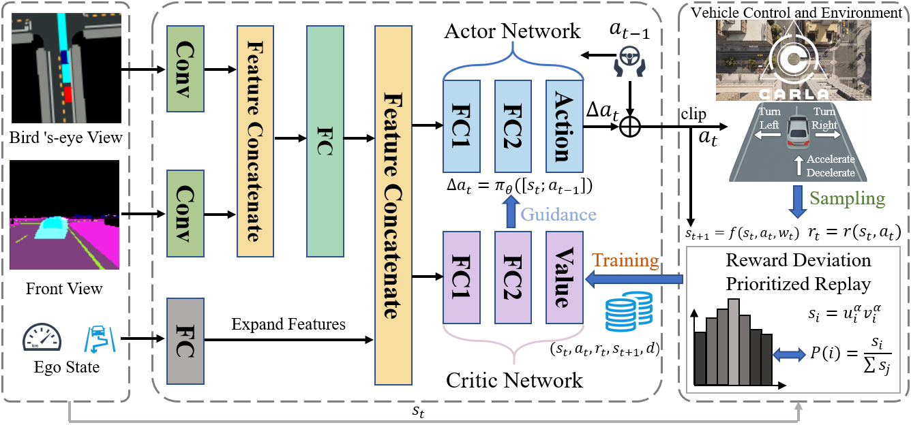

# RD-IARL: Residual Action Based on End-to-End Reinforcement Learning for Autonomous Driving in CARLA


This project implements a **Deep Deterministic Policy Gradient (DDPG)** agent with **residual action blending** for continuous autonomous driving control in the [CARLA simulator](https://carla.org/). The agent takes multi-modal observations (bird's-eye view, semantic segmentation, and ego-vehicle state) and outputs continuous throttle and steering commands.

> **Evaluation-only release** — This repository contains the pretrained model weights and inference code for reproducing the evaluation results reported in our paper. Training code (reward functions, experience replay, critic network, etc.) is **not** included. Once the paper is accepted, we will fully disclose the complete code.



---

## Table of Contents

- [Architecture](#architecture)
- [Repository Structure](#repository-structure)
- [Prerequisites](#prerequisites)
- [Installation](#installation)
- [Quick Start](#quick-start)
- [Command-Line Arguments](#command-line-arguments)
- [Evaluation Metrics](#evaluation-metrics)
- [Task Scenarios](#task-scenarios)
- [Observation & Action Space](#observation--action-space)
- [Citation](#citation)
- [License](#license)

---

**Key features:**

- Dual-stream CNN feature extractor (BEV + Semantic Segmentation)
- Residual action blending for smooth control output
- Multi-modal 14-dim ego state with curvature preview
- Supports roundabout and highway driving scenarios
- 100 NPC traffic vehicles for realistic evaluation

---

## Architecture

```
                    Observation
         ┌──────────┼──────────────┐
         v          v              v
   BEV (3x112x112) Semantic(3x112x112)  Ego State (14-dim)
         │          │                     │
  TinyVisionStem  TinyVisionStem          │
    (3-layer CNN)  (3-layer CNN)          │
         │          │                     │
    GAP (32-d)   GAP (32-d)              │
         └────┬─────┘                     │
           Concat (64-d)                  │
              │                           │
         MLP + LayerNorm (32-d)           │
              └──────────┬────────────────┘
                      Concat (46-d)
                         │
                    Actor MLP
                  46 → 32 → 16 → 8 → 2
                         │
                      tanh(·)
                         │
                   Residual Blend
            a = (1-α)·a_prev + α·δ
                         │
                  Action [acc, steer]
```

---

## Repository Structure

```
DDPG_RDIA_Release/
├── README.md                           # This file
├── run_test.py                         # Evaluation entry point
├── model.py                            # Network architecture & inference agent
├── model_weight/                       # Pretrained weights
│   ├── actor_net.pth                   #   Actor network
│   └── feature_extractor.pth          #   Feature extractor
├── results/                            # Auto-generated evaluation output
│   └── seed_0_0317_1430/              #   Run-tagged subdirectory
│       ├── eval_seed_0.csv            #     Per-episode metrics (CSV)
│       └── eval_raw_seed_0.npz        #     Per-step raw data (NPZ)
└── env_carla/                          # CARLA environment wrapper
    ├── __init__.py
    ├── carla_env.py                    #   Gym-like env (step / reset / obs)
    ├── route_planner.py                #   A* route planning & hazard detection
    ├── sensors.py                      #   Sensor factory (semantic cam, collision)
    ├── utils.py                        #   Geometry, curvature, lane drawing
    ├── agents/                         #   CARLA navigation agents
    │   ├── navigation/
    │   │   ├── global_route_planner.py
    │   │   ├── global_route_planner_dao.py
    │   │   └── local_planner.py
    │   └── tools/
    │       └── misc.py
    ├── cache/
    │   └── road_cache.py               #   Road topology cache for rendering
    └── rendering/
        ├── bev_renderer.py             #   Bird's-eye view renderer
        └── global_map_renderer.py      #   Debug global map visualization
```

---

## Prerequisites

| Dependency | Version | Notes |
|---|---|---|
| **CARLA Simulator** | 0.9.10 – 0.9.13 | Must be running before launching the script |
| **Python** | 3.7+ | Tested with 3.8 |
| **PyTorch** | 1.10+ | CUDA recommended |
| **NumPy** | < 2.0 | Recommended: `1.26.4` |
| **OpenCV** | 4.x | `opencv-python` |
| **Pygame** | 2.x | For real-time visualization |
| **NetworkX** | 2.x | Used by CARLA route planner |

---

## Installation

### 1. Install & Launch CARLA Simulator

Download CARLA 0.9.13 (recommended) from [https://github.com/carla-simulator/carla/releases](https://github.com/carla-simulator/carla/releases).

```bash
# Linux
cd /path/to/CARLA_0.9.13
./CarlaUE4.sh -prefernvidia

# Windows
cd C:\path\to\CARLA_0.9.13
CarlaUE4.exe
```

### 2. Set Up CARLA PythonAPI

Add the CARLA Python egg to your environment:

```bash
# Linux
export PYTHONPATH=$PYTHONPATH:/path/to/CARLA_0.9.13/PythonAPI/carla/dist/carla-0.9.13-py3.7-linux-x86_64.egg

# Windows (PowerShell)
$env:PYTHONPATH += ";C:\path\to\CARLA_0.9.13\PythonAPI\carla\dist\carla-0.9.13-py3.7-win-amd64.egg"
```

Or install via pip if a `.whl` is available:

```bash
pip install /path/to/carla-0.9.13-cp38-cp38-linux_x86_64.whl
```

### 3. Install Python Dependencies

```bash
pip install torch torchvision numpy==1.26.4 opencv-python pygame networkx
```

### 4. Clone This Repository

```bash
git clone https://github.com/<your-username>/DDPG_RDIA.git
cd DDPG_RDIA
```

### 5. Verify Model Weights

Ensure the pretrained weights are placed under `model_weight/`:

```
model_weight/
├── actor_net.pth
└── feature_extractor.pth
```

---

## Quick Start

**Step 1:** Start the CARLA simulator and wait until the world is loaded.

**Step 2:** Run the evaluation script:

```bash
python run_test.py
```

This will run **100 episodes** on the **Town03 roundabout** scenario with default settings.

### Example Output

```
[Run Tag] seed_0_0317_1430
====================================
Model has been loaded...
  actor:   ./model_weight/actor_net.pth
  feature: ./model_weight/feature_extractor.pth
====================================
── Test   1/100 done |  438 steps | succ 1 col 0 | R   +0.00 | spd 5.32 | dev 0.187 | route 100.0%
── Test   2/100 done |  512 steps | succ 1 col 0 | R   +0.00 | spd 4.98 | dev 0.214 | route 100.0%
...
Results saved to ./results/seed_0_0317_1430

========== Aggregate Results (100 episodes) ==========
  Success rate:       92/100 (92.0%)
  Collision rate:     3/100 (3.0%)
  Avg reward:         0.00
  Avg speed:          5.15 m/s
  Avg deviation:      0.201 m
  Avg heading angle:  3.64 deg
  Avg route compl:    96.8%
  Avg steer jerk:     0.0040
  Avg accel jerk:     0.0030
  Avg steer variance: 0.0125
  Avg accel variance: 0.0098
  Avg steer reversal: 88.2
  Avg lane changes:   1.3
=====================Example=========================
```

---

## Command-Line Arguments

### CARLA Connection

| Argument | Type | Default | Description |
|---|---|---|---|
| `--map` | str | `Town03` | CARLA map name |
| `--task_mode` | str | `roundabout` | Driving scenario (`roundabout` / `highway`) |
| `--carla_port` | int | `2000` | CARLA server port |
| `--synchronous_mode` | bool | `True` | Use synchronous simulation |
| `--no_rendering_mode` | bool | `False` | Disable server-side rendering |
| `--fixed_delta_seconds` | float | `0.05` | Simulation time step (20 Hz) |

### Environment

| Argument | Type | Default | Description |
|---|---|---|---|
| `--max_time_episode` | int | `2000` | Max steps per episode |
| `--number_of_vehicles` | int | `100` | Number of NPC vehicles |
| `--max_speed` | float | `9.0` | Speed limit (m/s) |
| `--out_lane` | float | `5.0` | Out-of-lane termination threshold (m) |
| `--max_angle` | float | `60.0` | Max heading deviation (deg) |
| `--acc_range` | float | `0.3` | Throttle/brake scaling factor |
| `--steer_range` | float | `0.4` | Steering scaling factor |

### Observation

| Argument | Type | Default | Description |
|---|---|---|---|
| `--img_size` | int int | `112 112` | Semantic camera resolution |
| `--bev_size` | int int | `112 112` | BEV image resolution |
| `--pixels_per_meter` | int | `3` | BEV spatial resolution |
| `--preview_distances` | float+ | `1.0 3.0 5.0` | Curvature preview distances (m) |

### Evaluation

| Argument | Type | Default | Description |
|---|---|---|---|
| `--seed` | int | `0` | Random seed |
| `--test_iteration` | int | `100` | Number of evaluation episodes |
| `--residual_alpha` | float | `0.8` | Residual blending coefficient |
| `--load_dir` | str | `./model_weight` | Path to pretrained weights |
| `--output_dir` | str | `./results` | Output root directory (data saved to `output_dir/seed_{k}_{MMDD_HHMM}/`) |
| `--device` | str | `cuda:0` | Compute device (`cuda:0` / `cpu`) |

### Usage Examples

```bash
# Run 50 episodes on the highway scenario
python run_test.py --task_mode highway --test_iteration 50

# Use CPU for inference
python run_test.py --device cpu

# Change map and NPC count
python run_test.py --map Town05 --number_of_vehicles 50

# Specify a custom weight directory
python run_test.py --load_dir ./checkpoints/best

# Save results to a custom output root
python run_test.py --output_dir ./my_experiment --seed 42
```

---

## Evaluation Metrics

### Per-Episode Metrics (saved to CSV)

Each row in `eval_seed_<seed>.csv` contains:

| Metric | Column Name | Formula | Description |
|---|---|---|---|
| **Success** | `success` | `{0, 1}` | Whether the ego vehicle reached the destination (within 10 m) |
| **Collision** | `collision` | `{0, 1}` | Whether a collision occurred during the episode |
| **Episode Reward** | `episode_reward` | `sum(rewards)` | Cumulative reward over the episode |
| **Avg Speed** | `average_speed` | `mean(speed)` | Mean forward speed (m/s) |
| **Avg Deviation** | `average_deviation` | `mean(\|lateral_dev\|)` | Mean absolute lateral deviation from lane center (m) |
| **Avg Heading Angle** | `average_angle` | `mean(\|heading_err\|)` | Mean absolute heading angle error (deg) |
| **Steer Variance** | `steer_variance` | `var(steer)` | Variance of steering actions (lower = smoother) |
| **Accel Variance** | `accel_variance` | `var(accel)` | Variance of acceleration actions (lower = smoother) |
| **Route Completion** | `route_completion` | `min(distance / 750, 1.0)` | Fraction of the planned route completed |
| **Steps** | `steps` | — | Number of simulation steps in the episode |
| **Lane Changes** | `lane_change_num` | — | Number of lane change events |
| **Steer Jerk** | `steer_jerk` | `mean(\|diff(steer)\|)` | Mean absolute first-difference of steering (lower = smoother) |
| **Accel Jerk** | `accel_jerk` | `mean(\|diff(accel)\|)` | Mean absolute first-difference of acceleration (lower = smoother) |
| **Steer Reversal** | `steer_reversal_count` | `count(sign changes in diff(steer))` | Number of steering direction reversals (lower = more consistent) |

### Aggregate Metrics (printed to console)

After all episodes, the script prints averaged statistics including: success rate, collision rate, avg speed, avg deviation, avg heading angle, avg route completion, avg steer/accel jerk, avg steer/accel variance, avg steer reversal count, and avg lane changes.

### Per-Step Raw Data (saved to NPZ)

`eval_raw_seed_<seed>.npz` stores flat arrays indexed by `episode_id` for fine-grained post-hoc analysis:

| Array Key | Type | Description |
|---|---|---|
| `episode_id` | int32 | Episode index for each step |
| `steer` | float32 | Steering action per step |
| `accel` | float32 | Acceleration action per step |
| `speed` | float32 | Forward speed (m/s) per step |
| `deviation` | float32 | Absolute lateral deviation (m) per step |
| `angle` | float32 | Absolute heading angle error (deg) per step |
| `reward` | float32 | Step reward |

**Loading the NPZ file for analysis:**

```python
import numpy as np
import pandas as pd

data = np.load('results/seed_0_0317_1430/eval_raw_seed_0.npz')
df = pd.DataFrame({k: data[k] for k in data.files})

# Per-episode statistics
grouped = df.groupby('episode_id')
print(grouped['speed'].mean())
print(grouped['steer'].apply(lambda s: np.mean(np.abs(np.diff(s)))))  # steer jerk
```

---

## Task Scenarios

### Roundabout (`--task_mode roundabout`)

- **Map:** Town03
- **Spawn:** Fixed position near the roundabout entrance
- **Challenge:** Navigate a multi-lane roundabout with dense NPC traffic, requiring merging, yielding, and lane-following

### Highway (`--task_mode highway`)

- **Map:** Town03
- **Spawn:** Fixed position on a straight highway section
- **Challenge:** High-speed driving with lane keeping, vehicle following, and potential overtaking

---

## Observation & Action Space

### Observation (dict)

| Key | Shape | Range | Description |
|---|---|---|---|
| `state` | `(14,)` | see below | Ego-vehicle state vector |
| `birdseye` | `(3, 112, 112)` | `[0, 1]` | Bird's-eye view (road, route, traffic) |
| `semantic` | `(3, 112, 112)` | `[0, 1]` | Semantic segmentation with lane overlay |

### Ego State Vector (14-dim)

| Index | Name | Range | Description |
|---|---|---|---|
| 0 | prev_throttle | [0, 1] | Previous throttle command |
| 1 | prev_steer | [-1, 1] | Previous steering command |
| 2 | prev_brake | [0, 1] | Previous brake command |
| 3 | heading_angle | [-1, 1] | Normalised heading deviation |
| 4 | lateral_dev | [-1, 1] | Normalised lateral deviation |
| 5 | speed | [0, 2] | Normalised speed |
| 6 | longitudinal_acc | [-1, 1] | Normalised longitudinal acceleration |
| 7 | red_light | {0, 1} | Red traffic light ahead |
| 8-10 | curvature_lat | [-1, 1] | Lateral offset at 3 preview distances |
| 11-13 | curvature_head | [-1, 1] | Heading change at 3 preview distances |

### Action (2-dim continuous)

| Index | Range | Description |
|---|---|---|
| 0 | [-1, 1] | Acceleration (+) / Braking (-) |
| 1 | [-1, 1] | Steering |

---

## Citation

If you find this work useful, please cite our paper:

```bibtex
@article{your_paper_key,
  title   = {RD-IARL: Incremental Action Reinforcement Learning Based on Reward Deviation for Multi-View End-to-End Autonomous Driving},
  author  = {Chengcheng Xu, Haiyan Zhaoa, Xinghao Lu, Bingzhao Gao, Hong Chen},
  journal = {Journal/Conference Name},
  year    = {2026}
}
```

---

## License

This project is released for **academic and research purposes only**. Please contact the authors for commercial use.
